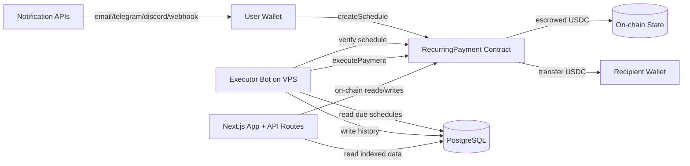

# ArcFlow Architecture

## Components

- Smart contract: single source of payment execution rules.
- Frontend: user UX, wallet actions, dashboards.
- API routes: metadata, analytics, notification plumbing.
- PostgreSQL: indexed query layer, analytics, notification preferences.
- VPS executor: liveness engine for overdue payment execution.

## Trust model

- Blockchain state is canonical.
- Database is non-authoritative cache/index.
- No custody of user keys on web infrastructure.
